<div align="center">

<!-- Header with elegant dark gradient -->


<br/>

<!-- Animated typing effect -->
[](https://git.io/typing-svg)
<br/>

<!-- Social badges with dark theme -->
<p>
<a href="mailto:105841102222@student.unismuh.ac.id"></a>
<a href="https://www.linkedin.com/in/ali-sultons-palilati-39553a2a3/"></a>
<a href="https://github.com/AliSultonsPalilati"></a>
</p>


</div>

---


## 🚀 About Me

```typescript
const aliSultons = {
    education: "Teknik Informatika - UNISMUH Makassar",
    semester: "7th (Senior Year)",
    gpa: "3.70/4.00",
    location: "Makassar, Indonesia 🇮🇩",
    
    passionate_about: [
        "🔬 Machine Learning & AI",
        "📊 Data Analysis & Visualization",
        "🌐 Full Stack Development",
        "🎯 Problem Solving with Code"
    ],
    
    currently_learning: [
        "Deep Learning Architectures",
        "Advanced NLP Techniques",
        "Cloud Computing (AWS/GCP)",
        "MLOps Best Practices"
    ],
    
    life_motto: "Transform data into decisions, code into solutions"
};
```

### 🎯 Quick Facts
- 🎓 **IPK:** 3.70/4.00 - Fokus pada Data Science & AI
- 💡 **Passion:** Mengubah data menjadi insight yang actionable
- 🌱 **Currently:** Exploring Deep Learning & Production ML
- 🎖️ **Achievement:** Multiple ML projects dengan 77%+ accuracy
- 📫 **Reach me:** [105841102222@student.unismuh.ac.id](mailto:105841102222@student.unismuh.ac.id)

<br clear="right"/>

---

## 💼 Technical Arsenal

<div align="center">

### 🎨 Languages & Core Technologies

<table>
<tr>
<td align="center" width="100" height="100">

<br><strong>Python</strong>
<br><sub>★★★★★</sub>
</td>
<td align="center" width="100" height="100">

<br><strong>JavaScript</strong>
<br><sub>★★★★☆</sub>
</td>
<td align="center" width="100" height="100">

<br><strong>Java</strong>
<br><sub>★★★★☆</sub>
</td>
<td align="center" width="100" height="100">

<br><strong>HTML5</strong>
<br><sub>★★★★★</sub>
</td>
<td align="center" width="100" height="100">

<br><strong>CSS3</strong>
<br><sub>★★★★★</sub>
</td>
</tr>
</table>

### 🤖 Data Science & Machine Learning

<p>


</p>

### 🌐 Web Development

<p>


</p>

### 🛠️ Tools & Platforms

<p>


</p>

</div>

---

## 🎯 Featured Projects

<div align="center">

<table>
<tr>
<td width="50%">

### 🌐 LADUNI LINK WEB
[](https://github.com/AliSultonsPalilati/LADUNI-LINK-WEB)

**Platform digital untuk menghubungkan komunitas Laduni**

🔧 **Tech Stack:**
- NestJS Backend
- Modern Web Technologies
- RESTful API Design

✨ **Features:**
- User Management System
- Community Interaction
- Real-time Updates
- Responsive Design

</td>
<td width="50%">

### 🏠 House Price Prediction
[](https://github.com/AliSultonsPalilati/ANALISIS-PREDIKSI-HARGA-RUMAH)

**ML model untuk prediksi harga properti**

📊 **Performance:** 77% Accuracy

🔧 **Tech Stack:**
- Python & Scikit-learn
- Multiple Linear Regression
- Pandas & NumPy
- Data Visualization

✨ **Features:**
- Feature Engineering
- Model Optimization
- Comprehensive Analysis

</td>
</tr>
<tr>
<td width="50%">

### 📈 Sales Trend Analysis
[](https://github.com/AliSultonsPalilati/ANALISIS-TREND-PENJUALAN-BARANG)

**Business intelligence untuk analisis penjualan**

✨ **Insights:**
- Top 5 Produk Terlaris
- Profitability Analysis
- Monthly/Yearly Trends
- Category Performance

🔧 **Tech Stack:**
- Python Data Analysis
- Matplotlib & Seaborn
- Statistical Analysis

</td>
<td width="50%">

### 🤖 ML Algorithm Comparison
[](https://github.com/AliSultonsPalilati/PERBANDINGAN-METODE-NAIVE-BAYES-LOGISTIC-REGRESSION)

**Credit risk classification comparison**

🔬 **Models Compared:**
- Naive Bayes
- Logistic Regression

📊 **Metrics:**
- Accuracy Analysis
- Confusion Matrix
- Performance Comparison

🔧 **Tech Stack:**
- Scikit-learn
- Classification Models
- Statistical Evaluation

</td>
</tr>
<tr>
<td width="50%">

### 🚗 Smart Parking System
[](https://github.com/AliSultonsPalilati/SISTEM-PARKIR-CERDAS)

**IoT-based smart parking solution**

✨ **Features:**
- Real-time Monitoring
- MQTT Protocol
- Vehicle Detection
- Web Dashboard

🔧 **Tech Stack:**
- HTML5 & CSS3
- MQTT Messaging
- IoT Integration

</td>
<td width="50%">

### 🚀 More Projects Coming Soon...
**Currently working on:**
- Deep Learning Projects
- NLP Applications
- Full Stack Web Apps

💡 Stay tuned for updates!

</td>
</tr>
</table>

</div>

---

## 🎓 Education & Certifications

<div align="center">

<table>
<tr>
<td width="60%">

### 🏫 Academic Background

**🎓 Sarjana Teknik Informatika**
```
🏢 Institution: Universitas Muhammadiyah Makassar
📅 Period: 2022 - Present (Expected 2026)
📊 GPA: 3.70/4.00
🏆 Status: Active (Semester 7)
```

**📚 Relevant Coursework:**
- 🔬 Data Science & Analytics
- ⛏️ Data Mining & Warehousing
- 🤖 Artificial Intelligence
- 💻 Software Engineering
- 🌐 Web Development
- 📊 Database Management Systems

</td>
<td width="40%">

### 🏆 Certifications


**Digital Talent Scholarship**
*Kementerian Kominfo*

---


**Belajar Dasar Visualisasi Data**
*Dicoding Indonesia*

---


**NDG Linux Unhatched**
*Cisco Networking Academy*

</td>
</tr>
</table>

</div>

---

## 👥 Experience & Involvement

<div align="center">

<table>
<tr>
<td width="50%">

### 🌟 Organizations & Communities


**GDSC Universitas Hasanuddin**
- 🤝 Active community member
- 💻 Tech discussions & workshops
- 🚀 Collaborative projects
- 📚 Knowledge sharing sessions

---


**Darul Arqam Dasar Committee**
- 🎯 Event organization (2x)
- 👥 Student orientation programs
- 📋 Administrative management
- 🤝 Team coordination

</td>
<td width="50%">

### 💼 Skills Development

**🎯 Technical Skills**
```python
skills = {
    'Data Science': ['ML', 'DL', 'Statistics'],
    'Web Dev': ['Frontend', 'Backend', 'API'],
    'Tools': ['Git', 'Linux', 'Cloud'],
    'Soft Skills': ['Problem Solving', 
                     'Team Work',
                     'Communication']
}
```

**🌱 Continuous Learning**
- 📖 Online courses & tutorials
- 🏆 Coding challenges
- 💡 Personal projects
- 🤝 Community contributions
- 📝 Technical documentation

</td>
</tr>
</table>

</div>

---

## 📊 GitHub Statistics

<div align="center">


<br/><br/>

[](https://github.com/ryo-ma/github-profile-trophy)

</div>

---

## 🎯 2025 Roadmap & Goals

```mermaid
%%{init: {'theme':'dark', 'themeVariables': { 'primaryColor':'#0f3460','primaryTextColor':'#00d4ff','primaryBorderColor':'#00d4ff','lineColor':'#00d4ff','secondaryColor':'#16213e','tertiaryColor':'#1a1a2e','background':'#1a1a2e','mainBkg':'#1a1a2e','textColor':'#94a3b8'}}}%%
graph LR
    A[🎓 Graduate<br/>with Honors] --> B[🏆 Kaggle<br/>Competitions]
    B --> C[🚀 Advanced<br/>ML Projects]
    C --> D[💼 Data Science<br/>Internship]
    D --> E[📝 Tech<br/>Blogging]
    E --> F[🌟 Open Source<br/>Contributions]
    F --> G[💼 Full-time<br/>Data Scientist]
    
    style A fill:#0f3460,stroke:#00d4ff,stroke-width:3px,color:#00d4ff
    style B fill:#16213e,stroke:#00d4ff,stroke-width:3px,color:#00d4ff
    style C fill:#0f3460,stroke:#00d4ff,stroke-width:3px,color:#00d4ff
    style D fill:#16213e,stroke:#00d4ff,stroke-width:3px,color:#00d4ff
    style E fill:#0f3460,stroke:#00d4ff,stroke-width:3px,color:#00d4ff
    style F fill:#16213e,stroke:#00d4ff,stroke-width:3px,color:#00d4ff
    style G fill:#1a1a2e,stroke:#00d4ff,stroke-width:4px,color:#00d4ff
```

<div align="center">



### 🎯 Current Focus Areas

<table>
<tr>
<td align="center" width="25%">

<br><strong>Deep Learning</strong>
<br><sub>Neural Networks & CNNs</sub>
</td>
<td align="center" width="25%">

<br><strong>MLOps</strong>
<br><sub>Model Deployment & Monitoring</sub>
</td>
<td align="center" width="25%">

<br><strong>Cloud Computing</strong>
<br><sub>AWS & GCP</sub>
</td>
<td align="center" width="25%">

<br><strong>Full Stack</strong>
<br><sub>React & NestJS</sub>
</td>
</tr>
</table>

### 📈 Short-term Goals (2025)

- ✅ Complete academic degree with honors
- 🎯 Contribute to 3+ open-source projects
- 🏆 Achieve Kaggle Expert status
- 💼 Secure Data Science internship
- 📝 Publish 10+ technical articles
- 🚀 Deploy 5+ production ML models

</div>

---

## 💬 Let's Connect & Collaborate!

<div align="center">


**"Transforming data into insights, one algorithm at a time."**

<br/>

### 📬 Get in Touch

<table>
<tr>
<td align="center" width="33%">

<br><strong>Email</strong>
<br><a href="mailto:105841102222@student.unismuh.ac.id">

</a>
</td>
<td align="center" width="33%">

<br><strong>LinkedIn</strong>
<br><a href="https://www.linkedin.com/in/ali-sultons-palilati-39553a2a3/">

</a>
</td>
<td align="center" width="33%">
  
  <br><strong>GitHub</strong>
  <br>
  <a href="https://github.com/AliSultonsPalilati">
    
  </a>
</td>
</tr>
</table>

<br/>

---


### 💭 Developer's Wisdom

[](https://github.com/piyushsuthar/github-readme-quotes)

<br/>

**✨ "In data we trust, in code we create, in innovation we thrive." ✨**

<br/>


### 🌟 Thanks for visiting! Don't forget to ⭐ star repositories you find interesting!


</div>