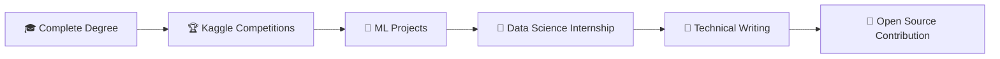

<div align="center">


[](https://git.io/typing-svg)


</div>

---


## 🙋‍♂️ About Me

**🎓 Student** | **📊 Data Enthusiast** | **🤖 ML Explorer**

- 🏫 Mahasiswa **Teknik Informatika Semester 6** di **Universitas Muhammadiyah Makassar**
- 📈 **IPK 3.70/4.00** dengan fokus pada Data Science & Machine Learning
- 🔥 Passionate dalam menganalisis data dan membangun model predictive
- 🌱 Selalu belajar teknologi terbaru di bidang AI dan Data Science
- 🎯 Goal: Menjadi **Data Scientist** yang dapat memberikan impact positif
- 📧 Contact me: **105841102222@student.unismuh.ac.id**
- 🌍 Location: **Makassar, Indonesia** 🇮🇩

### 💭 Current Focus
```python
class AliSultonsPalilati:
    def __init__(self):
        self.name = "Ali Sultons Palilati"
        self.role = "Data Science Student"
        self.language_spoken = ["Indonesian", "English"]
        
    def current_work(self):
        return [
            "🔍 Learning Advanced ML Algorithms",
            "📊 Building Predictive Models", 
            "🤖 Exploring Deep Learning",
            "📈 Data Analysis & Visualization"
        ]
```

<br clear="both"/>

---

## 🛠️ Tech Stack & Tools

<details>
<summary><b>🔥 Click to see my full toolkit!</b></summary>
<br>

### 💻 Programming Languages
<p align="center">
  
</p>

<table align="center">
<tr>
  <td align="center" width="100">
    
    <br><strong>Python</strong>
    <br>⭐⭐⭐⭐⭐
  </td>
  <td align="center" width="100">
    
    <br><strong>Java</strong>
    <br>⭐⭐⭐
  </td>
  <td align="center" width="100">
    
    <br><strong>JavaScript</strong>
    <br>⭐⭐⭐⭐
  </td>
  <td align="center" width="100">
    
    <br><strong>HTML5</strong>
    <br>⭐⭐⭐⭐
  </td>
  <td align="center" width="100">
    
    <br><strong>CSS3</strong>
    <br>⭐⭐⭐⭐
  </td>
</tr>
</table>

### 📊 Data Science & Machine Learning
<p align="center">
  
  
  
  
</p>

### 🌐 Web Development
<p align="center">
  
</p>

### 🛠️ Tools & Software
<p align="center">
  
</p>

</details>

---

## 🚀 Featured Projects

<div align="center">

### 🏠 Analisis Prediksi Harga Rumah


**🎯 Objective:** Sistem prediksi harga properti menggunakan Multiple Linear Regression

**🔧 Tech Stack:**
 
 
 


[](https://github.com/AliSultonsPalilati/ANALISIS-PREDIKSI-HARGA-RUMAH-SESUAI-SPESIFIKASI-MENGGUNAKAN-ALGORITMA-MULTIPLE-LINAER-REGRESSION)

---

### 📈 Analisis Trend Penjualan Barang


**🎯 Features:**
- 🏆 Top 5 produk terlaris
- 💰 Analisis profitabilitas produk  
- 📅 Trend penjualan bulanan & tahunan
- 📋 Kategori dengan performa terbaik

**🔧 Tech Stack:**
 
 


[](https://github.com/AliSultonsPalilati/ANALISIS-TREND-PENJUALAN-BARANG)

---

### 🤖 Perbandingan Naive Bayes vs Logistic Regression


**🎯 Objective:** Klasifikasi risiko kredit dengan perbandingan algoritma

**🔧 Tech Stack:**
 
 


[](https://github.com/AliSultonsPalilati/PERBANDINGAN-METODE-NAIVE-BAYES-LOGISTIC-REGRESSION-DALAM-KLASIFIKASI-RESIKO-KREDIT)

---

### 🚗 Sistem Parkir Cerdas


**🎯 Description:** Smart parking system berbasis MQTT untuk monitoring kendaraan

**🔧 Tech Stack:**
 
 


[](https://github.com/AliSultonsPalilati/SISTEM-PARKIR-CERDAS)

</div>

---

## 🎓 Education & Certifications

<table>
<tr>
<td width="50%">

### 🏫 Education
**🎓 S1 Teknik Informatika**
- 🏢 Universitas Muhammadiyah Makassar  
- 📅 2022 - Present
- 📊 **IPK: 3.70/4.00**
- 📚 Relevant Courses:
  - 🔬 Data Science
  - ⛏️ Data Mining  
  - 🤖 Kecerdasan Buatan

</td>
<td width="50%">

### 🏆 Certifications
- 📜 **Fundamental Data Science**  
  *Digital Talent Scholarship 2025 (Kominfo)*
  
- 📊 **Belajar Dasar Visualisasi Data**  
  *Dicoding*
  
- 🐧 **NDG Linux Unhatched**  
  *Cisco Networking Academy*

</td>
</tr>
</table>

---

## 👥 Experience & Activities


### 🌟 Organizations

**🚀 Google Developer Student Club**
- *Universitas Hasanuddin*
- Berkontribusi dalam kegiatan teknologi dan diskusi pengembangan

**🎯 Panitia DAD (Darul Arqam Dasar)**  
- *UNISMUH Makassar*
- Dua kali terlibat sebagai panitia orientasi mahasiswa

<br clear="both"/>

---

## 📊 GitHub Analytics

<div align="center">


[](https://github.com/ryo-ma/github-profile-trophy)

</div>

---

## 🎯 Goals & Future Plans

<div align="center">

### 📅 2024 Roadmap



**Current Goals:**
- 📚 Master Deep Learning techniques
- 🏆 Participate in Kaggle competitions  
- 🔬 Contribute to open-source ML projects
- 💼 Land Data Science internship
- 📝 Start technical blogging

</div>

---

## 🌐 Let's Connect!

<div align="center">

 

**Mari berkembang bersama dalam dunia Data Science!**

<p>
<a href="mailto:105841102222@student.unismuh.ac.id">
  
</a>
<a href="https://www.linkedin.com/in/ali-sultons-palilati-39553a2a3/">
  
</a>
<a href="https://github.com/AliSultonsPalilati">
  
</a>
</p>


</div>

---

<div align="center">

### 💭 Quote of the Day
[](https://github.com/piyushsuthar/github-readme-quotes)

**✨ "Every dataset has a story waiting to be told!" ✨**


⭐ **Don't forget to star repositories you find interesting!** ⭐

</div>